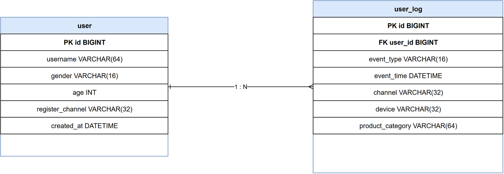

# E-R 图说明

本项目使用两张核心表：

- `user`：用户基础信息表。
- `user_log`：用户行为日志表，通过 `user_id` 外键关联 `user.id`。

关系：

```text
user 1 ── N user_log
```

可编辑源文件：

```text
docs/er-diagram.drawio
```

导出图片：

```text
docs/er-diagram.png
```


